# NeNe Clock

<p align="center">
  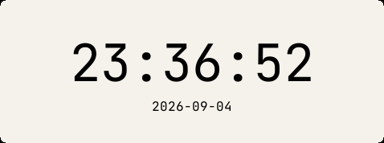
</p>

<p align="center">
  A quiet desktop clock. No frame, no buttons, no tray icon — just the time, in the typeface and colours you choose.<br>
  Windows (installer or portable zip) · Ubuntu (.deb) · no Java needed · <a href="README.ja.md">日本語</a>
</p>

<p align="center">
  <a href="#download-and-install--ダウンロードとインストール">Download</a> ·
  <a href="#how-to-use">How to use</a> ·
  <a href="#settings">Settings</a> ·
  <a href="#gallery">Gallery</a> ·
  <a href="#build-from-source">Build from source</a> ·
  <a href="#how-this-repository-is-run">How this repository is run</a>
</p>

---

## Download and install / ダウンロードとインストール

**No Java, no account, no command line.** The download already contains everything it needs.
**Java もアカウントもコマンドも要りません。** 落としたものだけで動きます。

### Windows

### ⬇ [**Get the installer — NeNe-Clock-Setup.msi**](https://github.com/hideyukiMORI/nene-clock/releases/latest/download/NeNe-Clock-Setup.msi)

1. Double-click the file you just downloaded.
2. Windows may show a blue screen: *"Windows protected your PC"*. Click **More info**, then **Run anyway**.
   It says that only because the app is not code-signed, and it asks only once.
3. Go through the installer, then start **NeNe Clock** from the Start Menu.

1. 落としたファイルをダブルクリックする。
2. 青い画面で「**Windows によって PC が保護されました**」と出たら、**「詳細情報」→「実行」**を押す。
   コード署名をしていないので出るだけで、聞かれるのは最初の 1 回だけ。
3. インストーラを進めて、**スタートメニュー**の「NeNe Clock」から起動する。

It installs for your user only, so there is no administrator prompt, and it uninstalls from
*Settings → Apps*. — ユーザー単位で入るので管理者権限は要らず、「設定 → アプリ」から消せる。

**Would rather not install anything?** Take the
[**portable zip**](https://github.com/hideyukiMORI/nene-clock/releases/latest/download/NeNe-Clock-windows-portable.zip)
instead: unzip it anywhere and double-click **`NeNe Clock.exe`** inside the folder. Keep the folder
together — the `.exe` needs the files next to it.

**入れたくない人は** [**ポータブル zip**](https://github.com/hideyukiMORI/nene-clock/releases/latest/download/NeNe-Clock-windows-portable.zip)
を落として、どこでもいいので展開し、中の **`NeNe Clock.exe`** をダブルクリックする。
フォルダはばらさないこと。`.exe` は隣のファイルを使う。

### Ubuntu / Debian

### ⬇ [**Get the package — nene-clock_amd64.deb**](https://github.com/hideyukiMORI/nene-clock/releases/latest/download/nene-clock_amd64.deb)

Then open a terminal and run it. / 落としたら端末を開いて、次を実行する。

```bash
sudo apt install ~/Downloads/nene-clock_amd64.deb
```

Start **NeNe Clock** from your application menu. To uninstall: `sudo apt remove nene-clock`.
アプリメニューの「**NeNe Clock**」から起動する。消すときは `sudo apt remove nene-clock`。

amd64 only. It also installs under WSL, where WSLg turns the menu entry into a Windows Start Menu
shortcut. — amd64 のみ。WSL にもそのまま入り、WSLg がメニュー項目を Windows のスタートメニューに出す。

### Good to know / 補足

| | |
| --- | --- |
| Works on / 動く環境 | Windows 10 / 11 (64-bit), Ubuntu and other Debian-based distributions (amd64) |
| Size / 大きさ | about 27–32 MB to download, about 90 MB installed |
| Needs / 必要なもの | nothing. No Java, no .NET, no internet — なし |
| Leaves behind / 残すもの | only its settings — Windows: `HKEY_CURRENT_USER\Software\JavaSoft\Prefs\io\github\hideyukimori\neneclock`, Linux: the same tree under `~/.java/.userPrefs` |

**Verify a download (optional).** Every Release also carries a `.sha256` file next to each download.
**検証（任意）。** Release には各ファイルの `.sha256` も置いてある。

```powershell
Get-FileHash .\NeNe-Clock-Setup.msi -Algorithm SHA256      # Windows
```

```bash
sha256sum nene-clock_amd64.deb                              # Linux
```

If `apt` prints *"Download is performed unsandboxed as root as file '…' couldn't be accessed by user
'_apt'"*, that is a notice, not an error — it appears whenever a local `.deb` sits in a folder only you
can read. — `apt` が「ユーザー '_apt' からアクセスできない…」と出すのは**警告であって失敗ではない**。
自分しか読めない場所に置いた `.deb` を指すと出る。

On Wayland sessions the clock runs through XWayland; the package depends on the usual X11 libraries,
which every Ubuntu desktop already has. macOS is not shipped — the build task produces a runnable image
there too, see [Build from source](#build-from-source).

---

## How to use

<p align="center">
  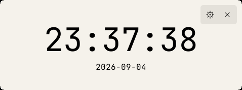
</p>

The window **is** the clock. There is no title bar and nothing to click until you hover.

| You want to… | Do this |
| --- | --- |
| **Move it** | Drag it — anywhere on the window. There is no move handle because you do not need one. |
| **Open settings** | Hover, then click the **gear** in the top-right corner. |
| **Quit** | Hover, then click the **×** next to the gear. Nothing keeps running in the background. |
| **Keep it above other windows** | Settings → *Always on top*. |
| **Bring it back next time** | Just launch `NeNe Clock.exe` again. Everything you changed is remembered. |

The icons fade in over 140 ms and out over 240 ms, follow your text colour, and never overlap the digits.
The window sizes itself to the widest possible time in your chosen typeface and size, so `05:14:59`
is never clipped — you do not resize it by hand.

---

## Settings

<p align="center">
  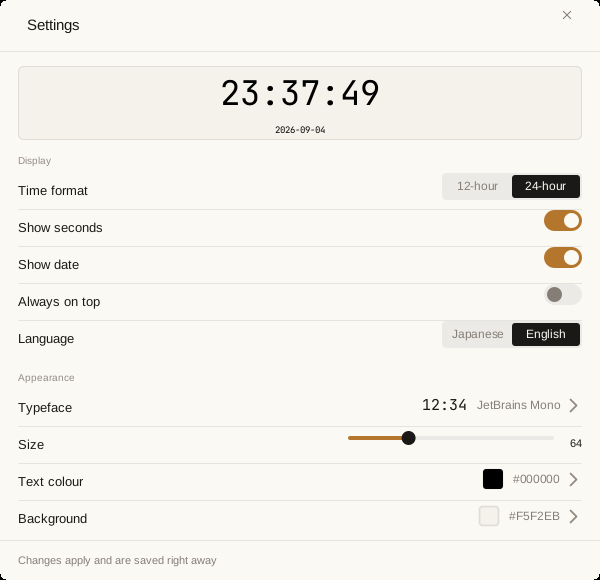
</p>

Every change applies **immediately** to the clock behind the modal and is saved as you go.
There is no OK, no Cancel, no Apply.

| Setting | What it does | Default |
| --- | --- | --- |
| Time format | `24-hour` (`23:36:52`) or `12-hour` (`11:36:52 PM`) | 24-hour |
| Show seconds | show or hide the seconds | on |
| Show date | show or hide the `2026-09-04` line | on |
| Always on top | keep the clock above other windows | off |
| Language | the settings UI in **Japanese** or **English**. The clock itself is language-neutral | Japanese |
| Typeface | one of 30 bundled fonts — see below | JetBrains Mono |
| Size | 24 to 160 pt. The date line scales with it | 64 |
| Text colour | 24 presets, a colour picker, or a hex code | `#000000` |
| Background | same controls as text colour | `#F5F2EB` |

The modal follows your clock: a dark background gives you a dark settings window.

<p align="center">
  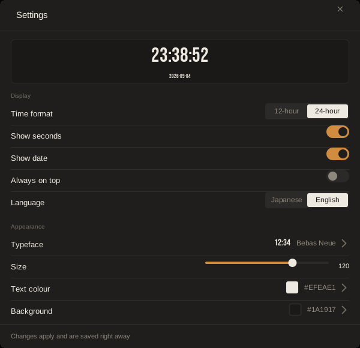
</p>

### Typeface

<p align="center">
  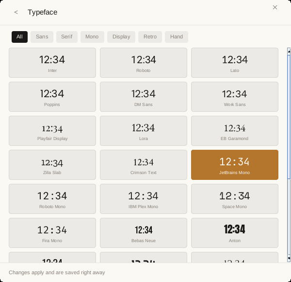
</p>

Thirty typefaces are **bundled inside the app**, so the clock looks the same on every machine and never
depends on what fonts Windows happens to have. Each card draws `12:34` in its own face, and the chips
filter by mood.

| Mood | Typefaces |
| --- | --- |
| Sans | Inter · Roboto · Lato · Poppins · DM Sans · Work Sans |
| Serif | Playfair Display · Lora · EB Garamond · Zilla Slab · Crimson Text |
| Mono | JetBrains Mono · Roboto Mono · IBM Plex Mono · Space Mono · Fira Mono |
| Display | Bebas Neue · Anton · Oswald · Righteous · Cinzel · Abril Fatface |
| Retro | Orbitron · Audiowide · Share Tech Mono · VT323 · Michroma |
| Hand | Caveat · Pacifico · Dancing Script |

All are Google Fonts under the SIL Open Font License 1.1, shipped unmodified. Provenance and
licences: [docs/licenses/typefaces.md](docs/licenses/typefaces.md).
Monospaced faces keep the digits from shifting as the seconds tick; that is why the default is one.

### Colours

<p align="center">
  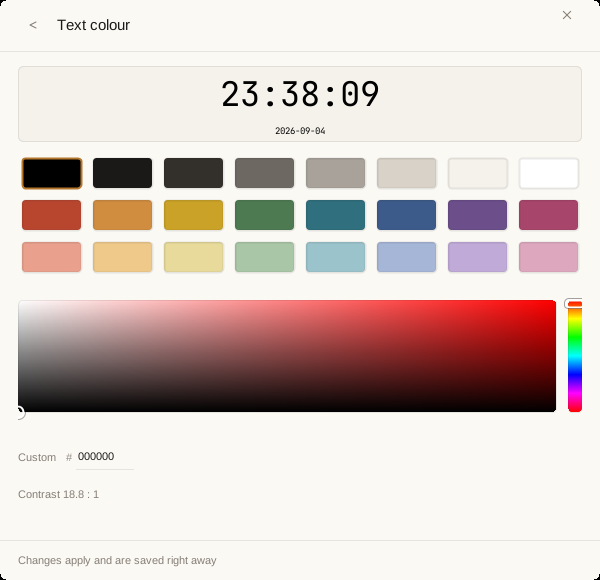
</p>

Text colour and background use the same screen:

- **24 presets** — eight neutrals from black to white, eight saturated tones, eight pastels.
- **A picker** — drag in the field for saturation and brightness, drag the bar for hue. The hex field,
  the preview and the clock follow as you drag; typing a hex code moves the picker.
- **A contrast readout.** If your two colours become hard to read (below 3 : 1), the number turns amber
  and a *Make it readable* button appears. It is a suggestion, not a rule — the app never overrides your choice.

There is no transparency setting, on purpose: semi-transparent windows flicker on some Windows setups,
and a setting that looks broken is worse than no setting
([ADR 0012](docs/adr/0012-transparency-is-dropped-the-artefact-is-not-ours.md)).

### Language

<p align="center">
  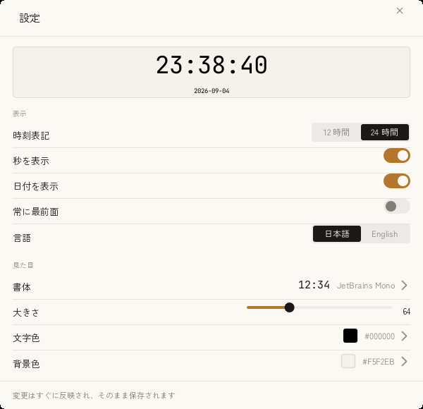
</p>

The UI ships in Japanese and English with its own bundled UI fonts (Zen Kaku Gothic New and Arimo).
The choice is a setting, not a guess from your Windows locale — it stays what you set it to.

---

## Gallery

Five settings, one app. Each of these is a real screenshot of the running clock.

| | |
| --- | --- |
| 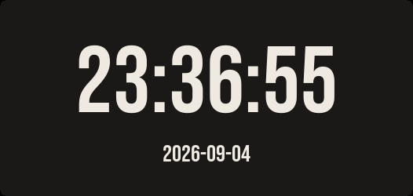 | **Bebas Neue** · 120 pt · `#EFEAE1` on `#1A1917` |
| 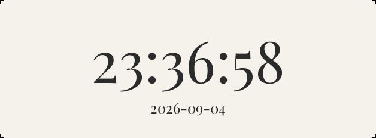 | **Playfair Display** · 96 pt · `#2B2B2B` on `#F5F2EB` |
| 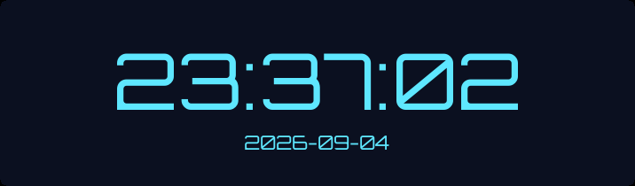 | **Orbitron** · 88 pt · `#5EE7FF` on `#0B1020` |
| 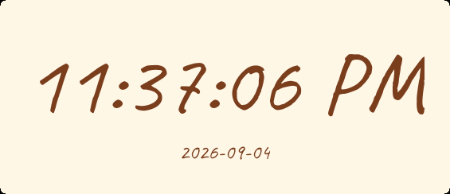 | **Caveat** · 110 pt · 12-hour · `#7A3E1D` on `#FFF7E6` |

---

## Build from source

You need a JDK 21. The Gradle Wrapper is committed, so nothing else.

```bash
./gradlew check              # the single definition of done — CI runs exactly this
./gradlew run                # launch the clock from source
./gradlew packageInstaller   # build the distributable (see below)
```

On Windows use `.\gradlew.bat` with the same task names. Under WSLg the window appears on the Windows
desktop with no `DISPLAY` setup; unit tests never need a display.

### The distributable

`packageInstaller` is the one path that produces what we ship
([ADR 0013](docs/adr/0013-windows-is-distributed-as-a-jpackage-msi.md),
[ADR 0014](docs/adr/0014-a-portable-zip-sits-beside-the-msi.md)):

1. `jpackage` builds an **app-image** — the launcher, your jars and a runtime trimmed to the modules
   `jdeps` says you need.
2. That folder is zipped as the **portable zip**. This is what the Release carries.
3. On Windows the same app-image is also wrapped into an **MSI**.
4. On Linux the same app-image becomes the **`.deb`**
   ([ADR 0015](docs/adr/0015-linux-is-distributed-as-a-deb.md)).

`jpackage` only builds for the OS it runs on, so the *Release* GitHub Actions workflow runs the task
once on a Windows runner and once on an Ubuntu runner, then collects both into one Release when a
`v*` tag is pushed. On macOS the same task still builds a runnable app-image and zip.

The app icon — the taskbar glyph, the PNGs, the `.ico` — is **drawn by the app itself** at build time
(`./gradlew writeAppIcons`). No image files for it live in the repository, so the picture can never go
stale against the code.

### Installing under WSL (developers)

```bash
sudo tools/install-desktop-entry.sh   # builds, copies to /opt/nene-clock, adds a .desktop entry
tools/place-windows-shortcut.sh       # copies the WSLg-made shortcut to the Windows desktop
```

WSLg turns the `.desktop` entry into a Start Menu shortcut on its own. Both scripts are idempotent;
`tools/uninstall-desktop-entry.sh` removes what they placed.

---

## How this repository is run

The clock is small. What is unusual is the constraint system around it: **every meaning has exactly one
canonical implementation path, and machines — not memory — keep it that way.**

```text
:app                        composition root
:ui:swing                   Swing panels and window
:adapters:system-time       the only module allowed to read the current time
:adapters:preferences       the only module allowed to touch java.util.prefs
:adapters:font-catalog      the bundled typefaces and their provenance
:core:application           ports, formatting, typed outcomes
:core:domain                values, invariants, closed choices (JDK only)
:quality:architecture-tests ArchUnit rules — architecture as executable tests
```

| Layer | Enforces |
|---|---|
| `javac -Xlint:all -Werror` | warnings are errors; `sealed` + `switch` exhaustiveness |
| Gradle module graph | dependency direction, no cycles, no unapproved modules |
| forbidden-apis | **per method**: no `now()`, `nanoTime()`, `Math.random()`, default zone/locale |
| Error Prone + NullAway | `null` means exactly one thing |
| Checkstyle | structure and complexity bounds |
| ArchUnit | **per package**: core knows nothing about Swing or Preferences |
| `validateConformance` | project-specific rules (naming, suppression waivers, `default`, docs integrity) |
| JaCoCo | branch coverage floor for the two core modules |
| font-catalog tests | every bundled font exists, matches its SHA-256, and renders at Regular weight |

The determinism rule is the interesting one: because `forbidden-apis` can name JDK method signatures
directly, "core may not read the wall clock" is a build failure here rather than a review convention.

| Document | Contents |
|---|---|
| [SPECIFICATION.md](SPECIFICATION.md) | what the product does (FR-NNN) |
| [docs/ARCHITECTURE_CONSTITUTION.md](docs/ARCHITECTURE_CONSTITUTION.md) | architectural rules (ARC-NNN) |
| [docs/CODING_RULES.md](docs/CODING_RULES.md) | Java and Swing rules (JAV-NNN, SWG-NNN) |
| [docs/QUALITY_GATES.md](docs/QUALITY_GATES.md) | which rules are mechanically enforced *today* |
| [docs/quality/gate-proofs.md](docs/quality/gate-proofs.md) | evidence that each gate really fires, and what was seen on screen |
| [docs/PROJECT_LAYOUT.md](docs/PROJECT_LAYOUT.md) | modules and allowed dependencies |
| [docs/DEVELOPMENT_WORKFLOW.md](docs/DEVELOPMENT_WORKFLOW.md) | how a change moves through the repo |
| [docs/adr/](docs/adr/) | decisions and what was rejected |

The normative documents are written in Japanese; code, comments and this README are in English.

### Roadmap

Done: the clock, persisted settings, the settings modal, bundled typefaces, colours, Japanese/English,
the Windows portable build. Not yet: a stopwatch and a countdown timer — they are specified
(FR-010 / FR-020) and deliberately not started. Where they will live in a window that has no tabs is
still an open design question.

## License

MIT — see [LICENSE](LICENSE). Bundled typefaces are SIL OFL 1.1 — see
[docs/licenses/typefaces.md](docs/licenses/typefaces.md).
